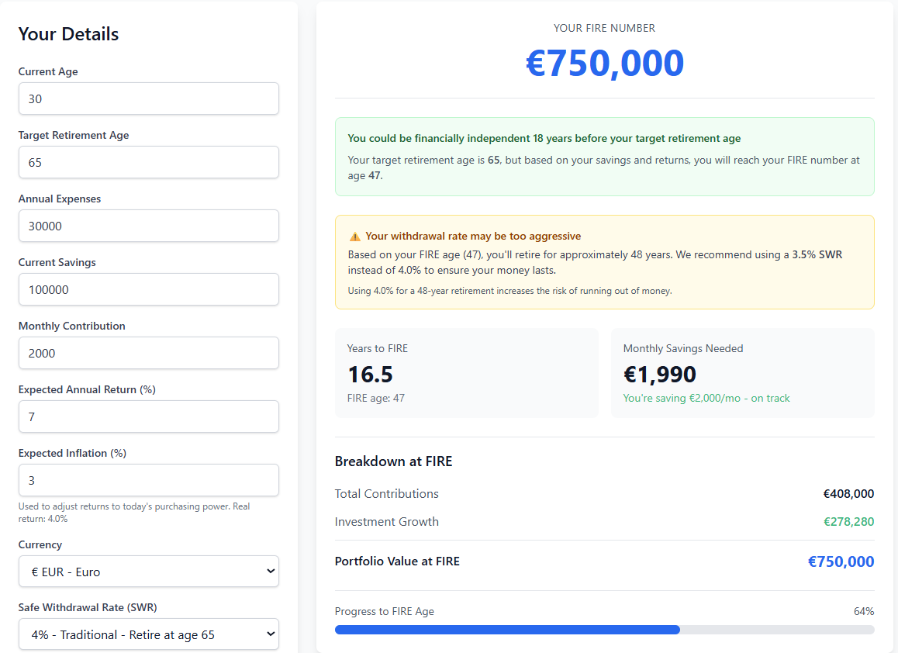

<picture>
  <source media="(prefers-color-scheme: dark)" srcset="docs/logo-dark.png">
  <source media="(prefers-color-scheme: light)" srcset="docs/logo-light.png">
  
</picture>

# FIRE Calculator

A data-driven FIRE (Financial Independence, Retire Early) calculator. Supports 6 currencies, includes state pension integration, and uses real (inflation-adjusted) returns.

**[Live Demo](https://wealthyparrot.github.io/fire-calculator/)** | **[Wealthy Parrot Blog](https://www.wealthyparrot.com/)**



## Why This Calculator?

- Multi-currency support (EUR, USD, GBP, SEK, NOK, DKK)
- Inflation-adjusted projections using real returns
- State pension integration to reduce your required FIRE number
- Three FIRE strategies: Traditional, Coast, and Barista FIRE
- No accounts, no tracking, no data collection -- runs entirely in your browser

## Features

- **Multi-currency support** -- EUR, USD, GBP, SEK, NOK, DKK with proper formatting
- **3 FIRE modes** -- Traditional, Coast FIRE (stop saving early), Barista FIRE (part-time income)
- **3 Safe Withdrawal Rates** -- 3%, 3.5%, 4% with guidance on which to choose
- **State pension integration** -- Enter your expected pension to see how it reduces your FIRE number
- **Inflation-adjusted projections** -- See results in today's purchasing power
- **Interactive chart** -- Year-by-year net worth growth visualization
- **Responsive design** -- Works on desktop and mobile
- **Open source** -- MIT license, free to use and modify

## Embed on Your Site

Add the calculator to your blog or website with an iframe. Use `?embed=true` for a compact layout (no header, minimal padding):

```html
<iframe
  src="https://wealthyparrot.github.io/fire-calculator/?embed=true"
  width="100%"
  height="800"
  frameborder="0"
  title="FIRE Calculator">
</iframe>
```

Or link directly to the standalone version: `https://wealthyparrot.github.io/fire-calculator/`

## Development

### Prerequisites

- Node.js 18+
- npm

### Setup

```bash
git clone https://github.com/wealthyparrot/fire-calculator.git
cd fire-calculator
npm install
```

### Commands

```bash
npm run dev      # Start dev server
npm run build    # Production build
npm run preview  # Preview production build
npm run test     # Run unit tests
```

### Tech Stack

- **React 19** + TypeScript
- **Vite** -- fast builds, HMR
- **Tailwind CSS** -- utility-first styling
- **Chart.js** -- net worth growth visualization
- **Vitest** -- unit testing (19 tests)

### Project Structure

```
src/
  components/
    CalculatorForm.tsx      # Input form with validation
    ResultsDisplay.tsx      # FIRE results and breakdown
    Chart.tsx               # Net worth projection chart
    CurrencySelector.tsx    # Currency picker
    SWRSelector.tsx         # Safe withdrawal rate selector
  utils/
    fire-calculations.ts    # Core FIRE math
    formatting.ts           # Currency/number formatting
  types/
    calculator.ts           # Input/output types
    currency.ts             # Currency types
  context/
    CalculatorContext.tsx    # React context for state
tests/
  fire-calculations.test.ts # Unit tests for calculations
```

## Contributing

Contributions are welcome. If you find a bug or want to add a feature:

1. Fork the repo
2. Create a branch (`git checkout -b feature/your-feature`)
3. Make your changes and add tests
4. Run `npm run test` to verify
5. Open a pull request

## License

MIT License -- see [LICENSE](LICENSE) for details.

---

Built by [Wealthy Parrot](https://www.wealthyparrot.com/) -- data-driven personal finance.
